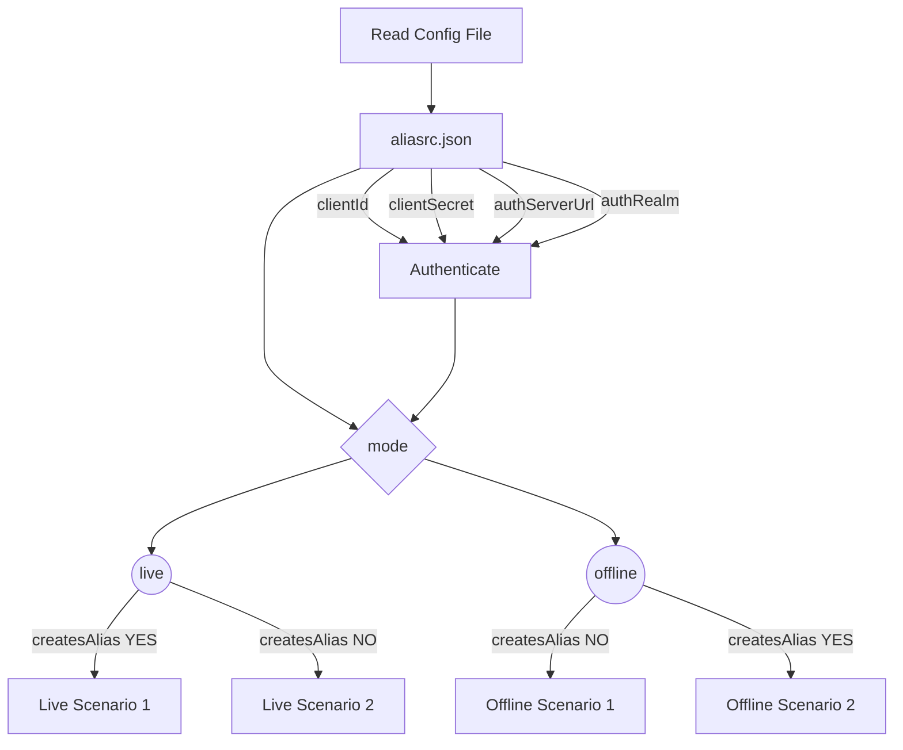
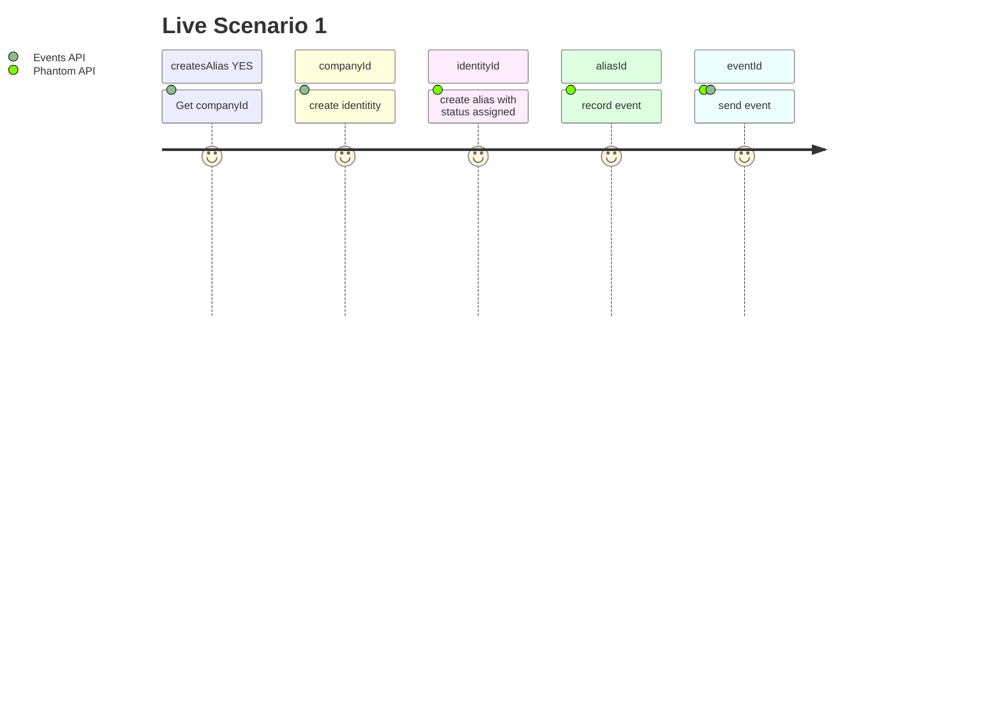
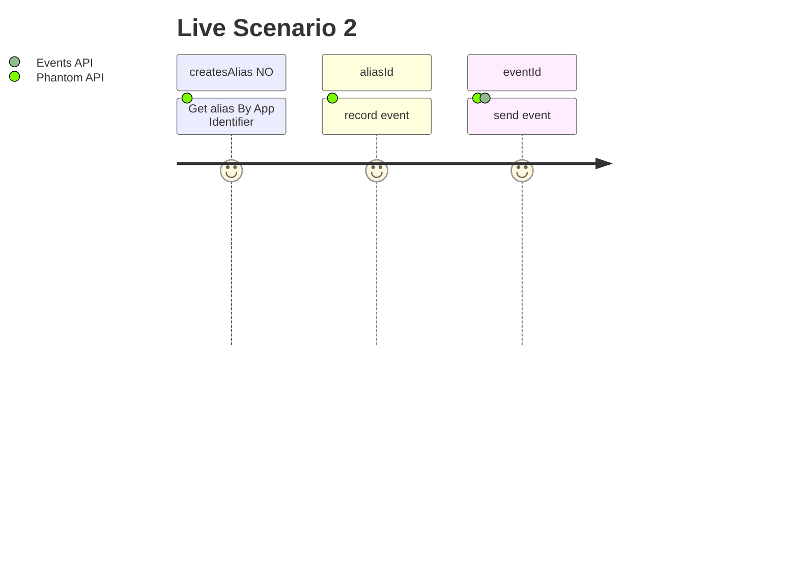
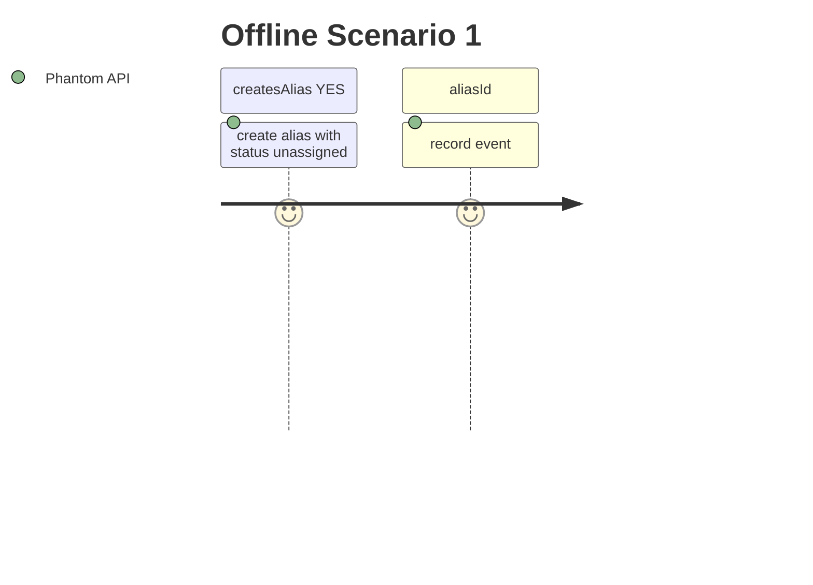
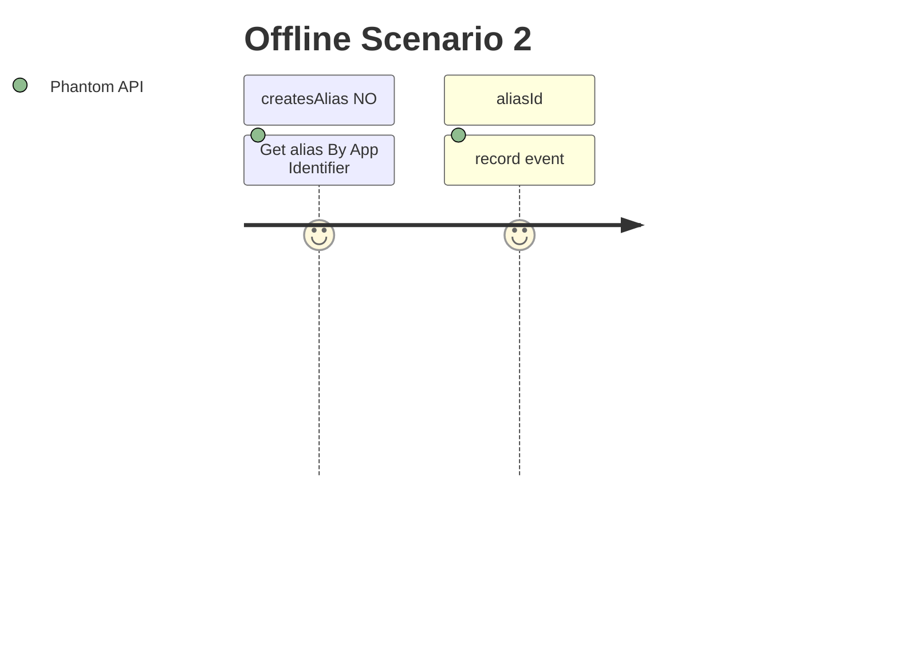

# SDK

```mermaid
graph TD
    A[Read Config File]
    B[aliasrc.json]
    C[Authenticate]
    D[Live Scenario 1]
    E[Live Scenario 2]
    F[Offline Scenario 1]
    G[Offline Scenario 2]
Z{mode}
Y((live))
X((offline))
    A --> B
    B --> |clientId| C
    B --> |clientSecret| C
    B --> |authServerUrl| C
    B --> |authRealm| C
    B --> Z
    C--->Z
    Z --> Y
    Z --> X
    Y --> |createsAlias YES|D
    Y --> |createsAlias NO|E
    X --> |createsAlias NO|F
    X --> |createsAlias YES|G
```

```mermaid
  journey
    title Live Scenario 1
    section createsAlias YES
      Get companyId: 8: Events API
    section companyId
      create identitity: 8: Events API
    section identityId
      create alias with status assigned: 8: Phantom API
    section aliasId
      record event: 8: Phantom API
    section eventId
      send event: 8: Phantom API, Events API
```

```mermaid
  journey
    title Live Scenario 2
    section createsAlias NO
      Get alias By App Identifier: 8: Phantom API
    section aliasId
      record event: 8: Phantom API
    section eventId
      send event: 8: Phantom API, Events API
```

```mermaid
  journey
    title Offline Scenario 1
    section createsAlias YES
      create alias with status unassigned: 8: Phantom API
    section aliasId
      record event: 8: Phantom API
```

```mermaid
  journey
    title Offline Scenario 2
    section createsAlias NO
      Get alias By App Identifier: 8: Phantom API
    section aliasId
      record event: 8: Phantom API
```
